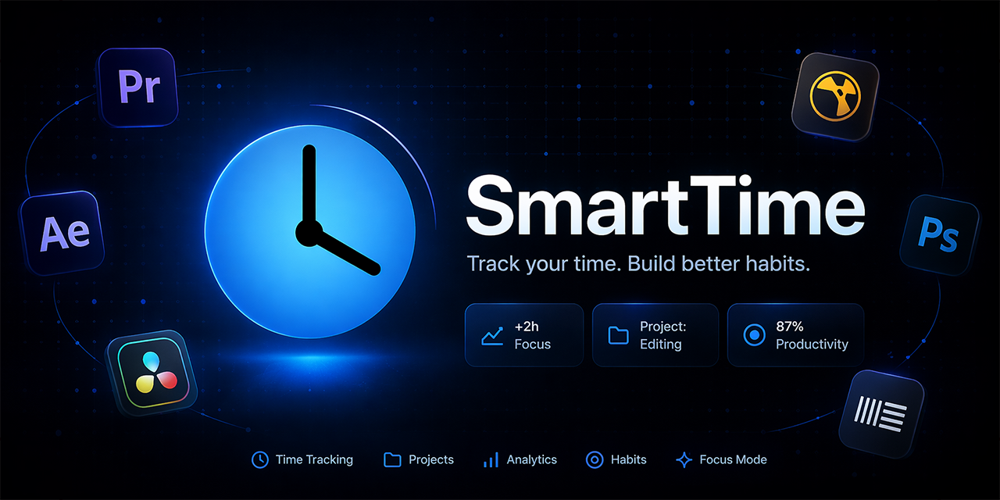

# <h1>  SmartTime </h1>

Stop guessing where your time goes.

SmartTime runs silently in the background and gives you a clear picture of how you actually spend your day — every app, every project, every minute.
100% local tracking data
# <h1> </h1>

What you get:

Real-time app tracking with zero setup
Instant breakdown of focused work vs. wasted time
A clean, distraction-free interface that stays out of your way
Smart daily insights that help you build better habits over time

Getting started:
Go to the Releases section
Download the latest .exe
Open and run it
If Windows shows a security warning, click More info → Run anyway. SmartTime is open and fully local — nothing leaves your machine.
